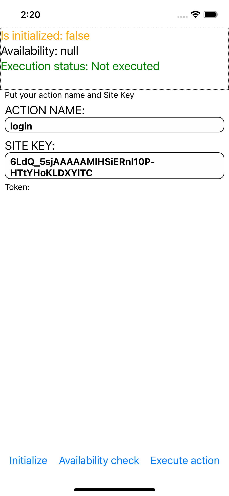
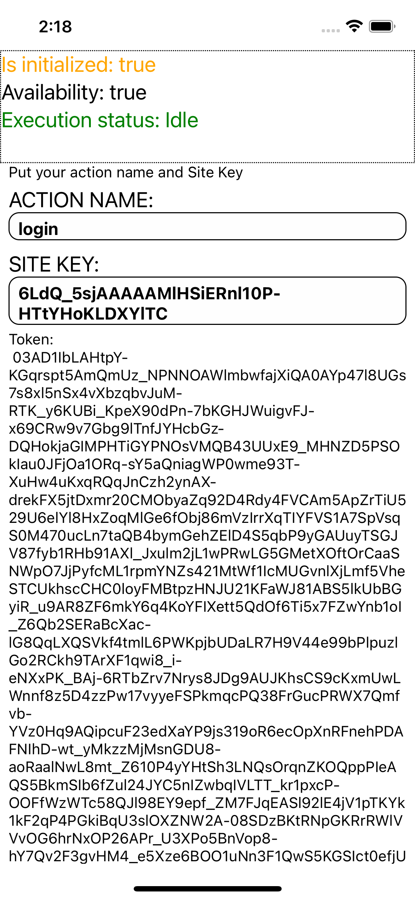
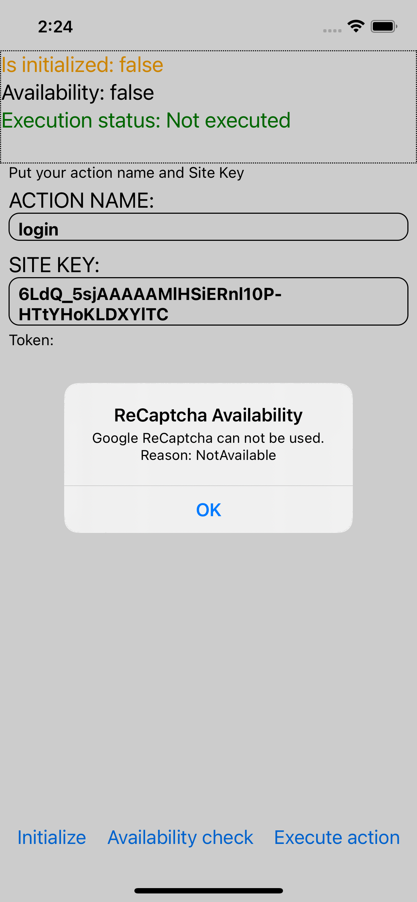
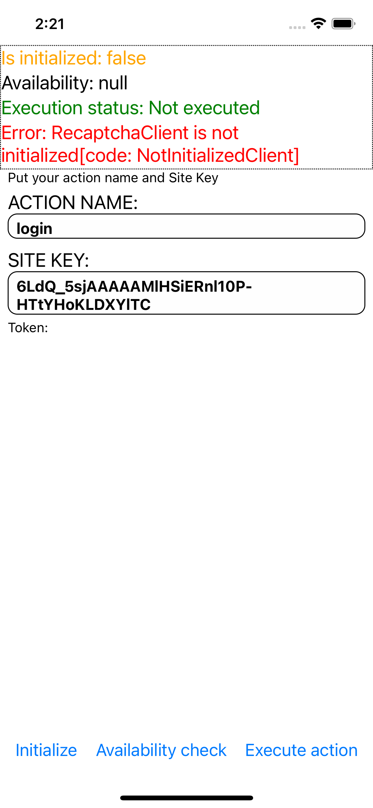
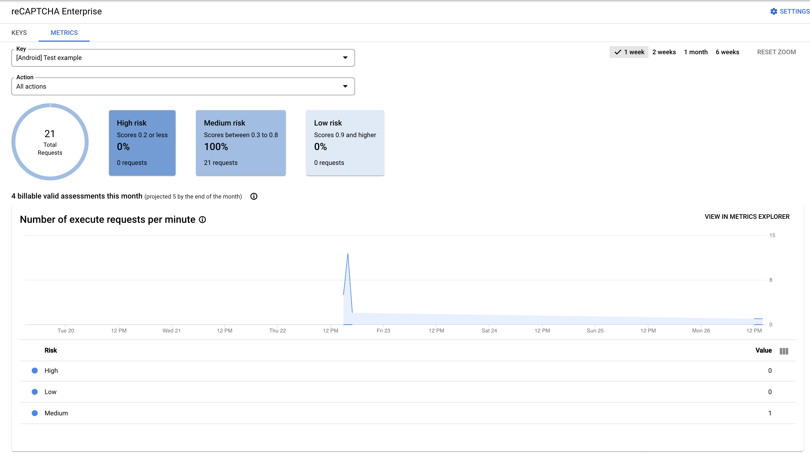
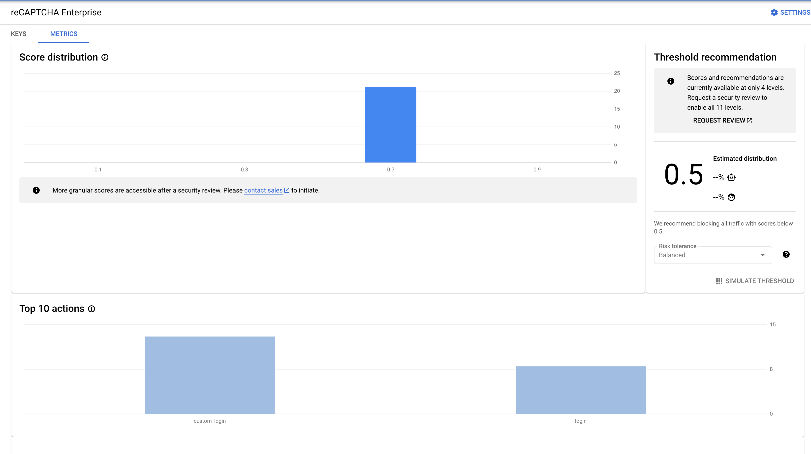

# react-native-recaptcha-enterprise

Google Enterprise reCaptcha. Implemented through native platforms. Support iOS and Android

<!-- BADGES/ -->

[](https://github.com/mav10/react-native-recaptcha-enterprise/actions/workflows/ci.yml)
<span class="badge-npmversion"><a href="https://www.npmjs.com/package/react-native-recaptcha-enterprise" title="View this project on NPM"></a></span>
<span class="badge-npmdownloads"><a href="https://www.npmjs.com/package/react-native-recaptcha-enterprise" title="View this project on NPM"></a></span>
<!-- /BADGES -->
___

## Installation
- Requires React Native version 0.60.0, or later.
- Supports iOS 14.0, or later,
- Supports android 23 level, or later.

via NPM
```sh
npm install react-native-recaptcha-enterprise
```

via Yarn
```sh
yarn add react-native-recaptcha-enterprise
```

#### :iphone:iOS (_Extra steps_)
- Since ios project is written in Swift, you need to have Swift enabled in your iOS project. If you already have any .swift files, you are good to go. Otherwise create a new empty Swift source file in Xcode, and allow it to create the neccessary bridging header when prompted.
- pod install

## Example
In [example folder](./example/src) there is simple workflow how to:
- Initialize reCaptcha client
- Execute actions
- Check availability
- Handle errors

How it looks like you can see here

<table align="Center">
  <tr>
    <td>Not init session</td>
    <td>Executed action (login)</td>
  </tr>
  <tr>
    <td></td>
    <td></td>
  </tr>
 </table>


<table align="Center">
  <tr>
     <td>Error unavailable (no Google Play Service)</td>
     <td>Error from native part (with code and description)</td>
  </tr>
  <tr>
    <td></td>
    <td></td>
  </tr>
 </table>



## Methods

**Important:** All methods are promise based and can throw exceptions.
List of errors is provided in [Error handling section](#error-handling)

### Initialize ReCaptcha
It is better to call it somewhere in the startup and use as `Singleton` instance further

 ```ts
import { initializeRecaptcha } from 'react-native-recaptcha-enterprise';

await initializeRecaptcha('YOUR_SITE_KEY');
```

### Execute
This method works only on initialized reCaptcha client [see initialization](#initialize-recaptcha) upper.

There is only one constant action-name - `LOGIN`. Another as `VIEWED_CART`, `SIGNIN` could be added by request.
You can pass any custom action name here, but it will be prefixed with string constant **custom_**
```js
import { executeAction } from 'react-native-recaptcha-enterprise';

const executeResult = await executeAction('YOUR_ACTION_NAME');
console.info('Token verify: ', executeResult);
```

### Check availability
In some cases this library doesn't work on native level. The reason why it happens - missing `Google Play Service` (gms package). It could be a real case of you end users as some smartphones doesn't have Google environment at all as Xiaomi, Huawei etc. So it is recomended to check it before, or you can handle error in `initialization handler` by:
```ts
errorCode === RecaptchaErrorCodes.NotAvailable
```
As ***availability check*** is called on native part during initialization too.

Implementation of direct method call:
```js
const checkAvailability = useCallback(async () => {
  try {
    setInProgress(true);
    const canUseResult = await canUseRecaptcha();

    if (canUseResult.result) {
      setCanUse(true);
      return;
    }

    setCanUse(false);
    Alert.alert(
      'ReCaptcha Availability',
      'Google ReCaptcha can not be used. Reason: ' + canUseResult.reason
    );
  } catch (e: any) {
    setError(`${e?.message}[code: ${e?.code}]`);
  } finally {
    setInProgress(false);
  }
}, []);
```

## Error handling:
List of supported events:
```ts
export enum RecaptchaErrorCodes {
  'NotInitializedClient' = 'NotInitializedClient',
  'NotAvailable' = 'NotAvailable',
  /* Android: UNKNOWN_ERROR, ios: RecaptchaErrorCodeUnknown */
  'RecaptchaErrorCodeUnknown' = 0,
  /* Android: NETWORK_ERROR, ios: RecaptchaErrorNetworkError */
  'RecaptchaErrorNetworkError' = 1,
  /* Android: INVALID_SITEKEY, ios: RecaptchaErrorInvalidSiteKey */
  'RecaptchaErrorInvalidSiteKey' = 2,
  /* Android: INVALID_KEYTYPE, ios: RecaptchaErrorInvalidKeyType */
  'RecaptchaErrorInvalidKeyType' = 3,
  /* Android: INVALID_PACKAGE_NAME, ios: RecaptchaErrorInvalidPackageName */
  'RecaptchaErrorInvalidPackageName' = 4,
  /* Android: INVALID_ACTION, ios: RecaptchaErrorInvalidAction */
  'RecaptchaErrorInvalidAction' = 5,
  /* Android: INTERNAL_ERROR, ios: RecaptchaErrorCodeInternalError */
  'RecaptchaErrorCodeInternalError' = 100,
}
```

All throwable exception from native part has common object structure:
```ts
export type RecaptchaErrorType = {
  code: RecaptchaErrorCodes;
  message: string;
  rawData: any;
};
```

Where:
- code - is error code constant (in human-readable format)
- message - description of error, to define what happened.
- rawData - whole error object thrown from native part.

You can handle it with `Promise.catch().then()` approach - classical Promise resolving or use modern one - `async/await` in combination with `try/catch` statement.

Short example:
```ts
try {
  setInProgress(true);
  const executeResult = await executeAction(actionName);
  setToken(executeResult);
} catch (e: any) {
  // Where: e - is RecaptchaErrorType
  console.log(`${e?.message}[code: ${e?.code}]`);
} finally {
  setInProgress(false);
}
```

## Contributing
See the [contributing guide](CONTRIBUTING.md) guide to learn how to contribute to the repository and the development workflow.

## License

MIT

---

Made with [create-react-native-library](https://github.com/callstack/react-native-builder-bob)
